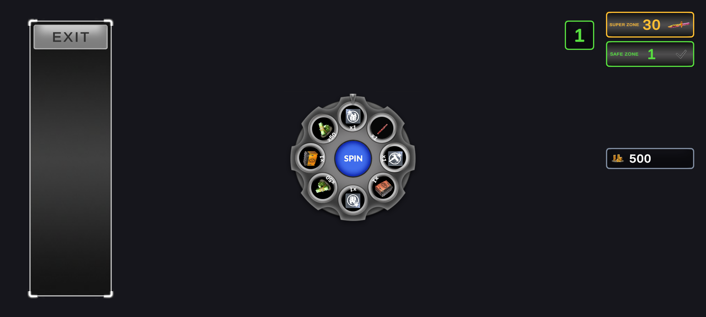
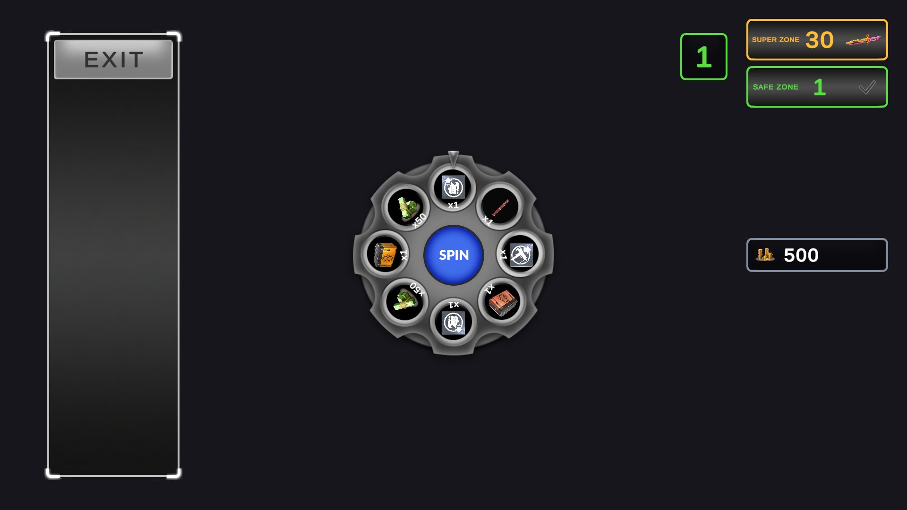
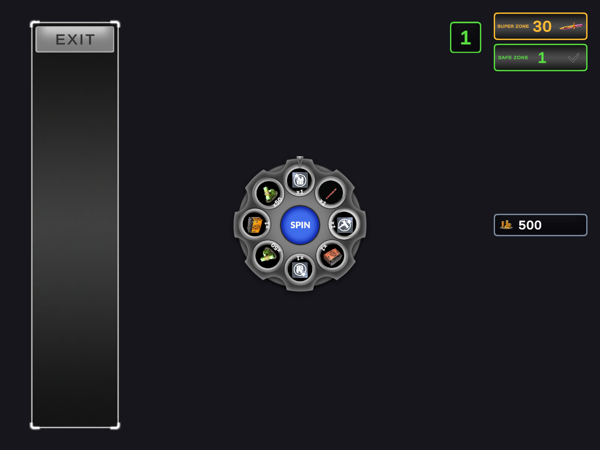
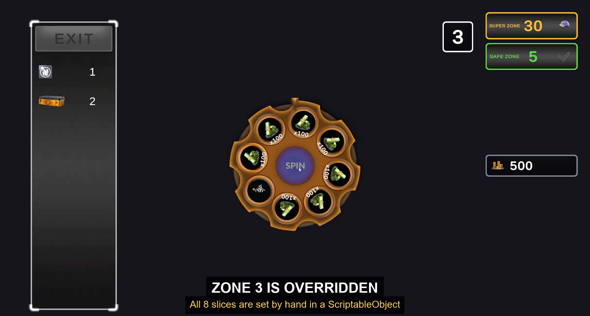
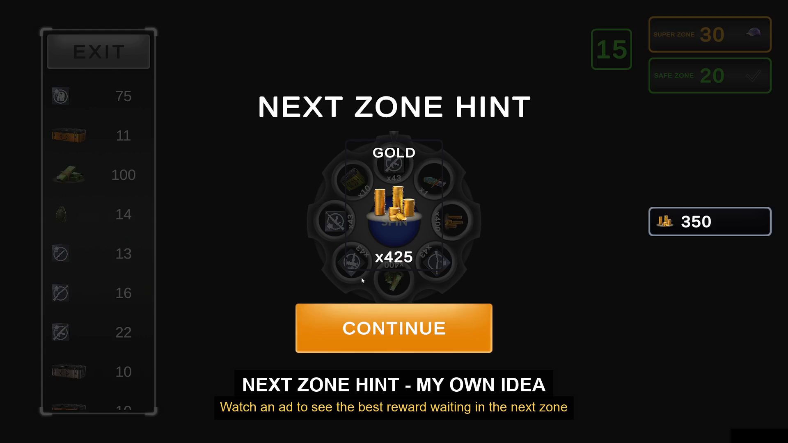

# Wheel of Fortune

---

## Video

[**Watch the gameplay video**](https://drive.google.com/file/d/1F6EvGE_bxK7qtbxdDJT4ts6WxUYiWMkX/view?usp=sharing)

The video has text on it for the zone override and the next zone hint.

---

## Screenshots

**20:9**

**16:9**

**4:3**

---

## Zone override

Rewards on the wheel are random, but any zone can be set by hand instead.
Zone 3 is done this way — all cash. You can see it in the video.

---

## Next zone hint (my own idea)

This is not in the brief. I added it myself.

The player can watch an ad to see the best reward waiting in the next zone.
I wanted to give the player a reason to keep going instead of leaving.
You can see it in the video.

---

## Continue with currency (bonus part)

The brief says this one is a bonus, so I did it.

When the bomb explodes the player can give up, pay currency to revive, or watch an ad to revive for free.
Every revive costs more than the last one.
